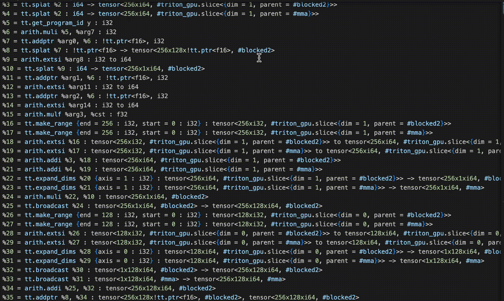

<h2 align="center"> Triton Layout Viewer</h2>

<strong>Extension for Viewing Triton Layouts</strong>

## About

Triton Layout Viewer lets you easily visualize how data is accessed by a triton layout. Just select the layout attribute of the tensor you want to visualize and select "#Find Selection" from the drop down menu.

Here's how you use it:

## Features

Currently only support the visualization of blocked layouts

## Release Notes

Initial Release

### 1.0.0

**Enjoy!**
